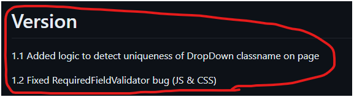

# Using and updating application repos

Most repos come with Javascript and CSS files that are occasionally updated to fix bugs and add features. 

Please do not make changes to either the Javascript nor the styles in the CSS files. The only customisation that is encouraged is the changing of variable values in the css variables files as explained below. 

## Working with repos
For all repos you want to use in a given applications, perform the following steps:

1. Make a clone of each repo specifically for the application you want to develop

2. Change ONLY the variables in the CSS variables file, usually called something like *module-variables.css*
3. Do not 
   1. Add or remove empty lines in the CSS files or the Javascript
   2. Do not add new variables to the CSS files
   3. Do not remove any of the existing variables from the CSS files

4. Implement the CSS and the Javascript in your application as described in the respective repo

## Updating module assets
Release notes can be found in each respective repo. Review these before updating a module. 

In order to update a module:

1. Commit changes you made to the CSS variables file 
2. Pull the latest repo
3. Merge all changes (If you have made changes beyond the variables, you will now have to deal with merge conflicts. This can be a terribly annoying and somewhat messy operation. In this case I recommend that you backup your changes first.)
4. Finally
   1. Copy the updated CSS files into the application as described in the respective repo
   2. Select "Overwrite" when prompted in Stadium
   3. Copy the updated Javascript into the script in your application as described in the respective repo

### Updating Javascript
All Javascript starts with a version comment. If the version of this script you are using in your application is different, you may want to update the script. Please note that sometimes newer versions of scripts require more or fewer parameters. 

## Repo bugs
I am happy about every bug we find as it gives me the opportunity to make the module better! If you find a bug in a module, please let me know by [logging an issue](https://docs.github.com/en/issues/tracking-your-work-with-issues/creating-an-issue) in the Github Issues section of the respective repo. 
 
If you feel you can change the code yourself, please [add a pull request](https://docs.github.com/en/pull-requests/collaborating-with-pull-requests/incorporating-changes-from-a-pull-request/merging-a-pull-request-with-a-merge-queue#adding-a-pull-request-to-a-merge-queue) and I will review your fix! 